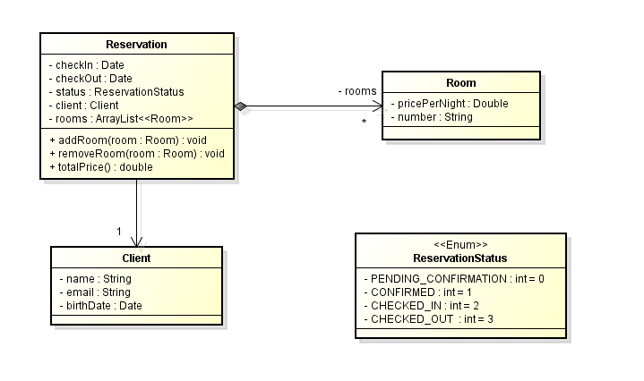

# *Sistema de Reservas de Hotel* 🏨  

## 📌 *Descrição do Projeto*  
Este projeto é um sistema de reservas de hotel desenvolvido em *Java, que permite gerenciar clientes, quartos e reservas. A estrutura segue um modelo **orientado a objetos*, com classes representando os principais elementos do sistema.

---

## 📊 *Diagrama UML*


(Substitua "diagrama.png" pelo nome exato da sua imagem na pasta img.)

---

## 📂 *Estrutura do Projeto*  

### 🔹 *Classes Principais*  

1. *Reservation* (Reserva)  
   - Representa uma reserva de hotel, contendo informações sobre:
     - 📅 Datas de check-in e check-out.
     - 📌 Status da reserva (Pendente, Confirmada, Check-in, Check-out).
     - 👤 Cliente associado à reserva.
     - 🏨 Lista de quartos incluídos na reserva.
   - *Métodos*:
     - addRoom(Room room): Adiciona um quarto à reserva.
     - removeRoom(Room room): Remove um quarto da reserva.
     - totalPrice(): Calcula o valor total da reserva.

2. *Client* (Cliente)  
   - Representa um cliente que realiza a reserva.  
   - *Atributos*:
     - 🏷️ Nome.
     - 📧 E-mail.
     - 🎂 Data de nascimento.

3. *Room* (Quarto)  
   - Representa um quarto do hotel.  
   - *Atributos*:
     - 💲 Preço por noite.
     - 🔢 Número do quarto.

4. *ReservationStatus* (Enumeração)  
   - Define os possíveis estados de uma reserva:
     - PENDING_CONFIRMATION = 0 (Pendente).
     - CONFIRMED = 1 (Confirmada).
     - CHECKED_IN = 2 (Check-in realizado).
     - CHECKED_OUT = 3 (Check-out realizado).

---

## 🚀 *Funcionalidades*
✅ Criar clientes e associá-los a reservas.  
✅ Adicionar e remover quartos de uma reserva.  
✅ Calcular o valor total da estadia com base nos quartos selecionados.  
✅ Alterar o status da reserva.  

---

## ⚙️ *Tecnologias Utilizadas*
- 🖥️ *Java 17+*
- 🔹 *Paradigma Orientado a Objetos (POO)*
- 📂 *Coleções Java (ArrayList)*
- 🏷️ *Enumerações*

---

## ▶️ *Como Executar*
1. Clone o repositório:  
   ```bash
   git clone https://github.com/seu-usuario/seu-repositorio.git
   cd seu-repositorio
